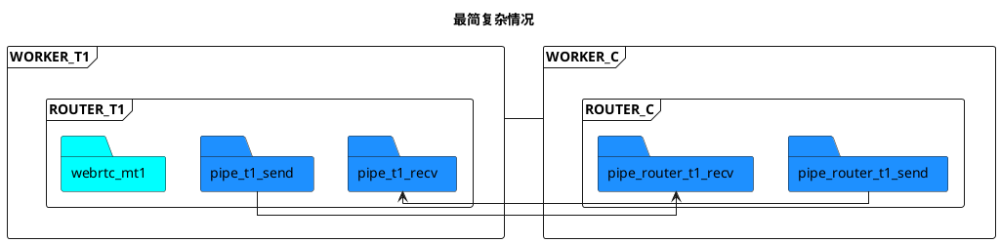
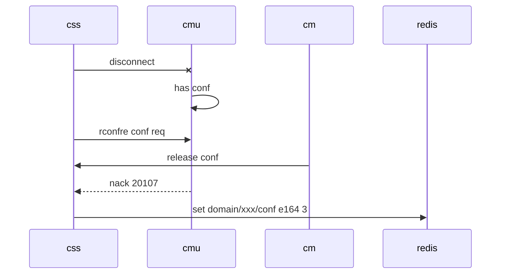

# test

```puml
@startuml

skinparam linetype ortho

skinparam entity{
BorderColor orange
}

title 最简复杂情况

frame WORKER_C{
    frame ROUTER_C{
        folder pipe_router_t1_recv#dodgerblue{
        }
        folder pipe_router_t1_send#dodgerblue{
        }
    }
}
frame WORKER_T1{
    frame ROUTER_T1{
        folder webrtc_mt1#cyan{
        }
        folder pipe_t1_send#dodgerblue{
        }
        folder pipe_t1_recv#dodgerblue{
        }
    }
}

WORKER_T1-u--WORKER_C
pipe_t1_recv<-pipe_router_t1_send
pipe_t1_send->pipe_router_t1_recv

@enduml
```

```mermaid
sequenceDiagram

css-xcmu: disconnect
cmu->>cmu: has conf
css->>cmu: rconfre conf req
cm->>css:  release conf
cmu-->>css: nack  20107
css->>redis: set domain/xxx/conf e164 3
```
